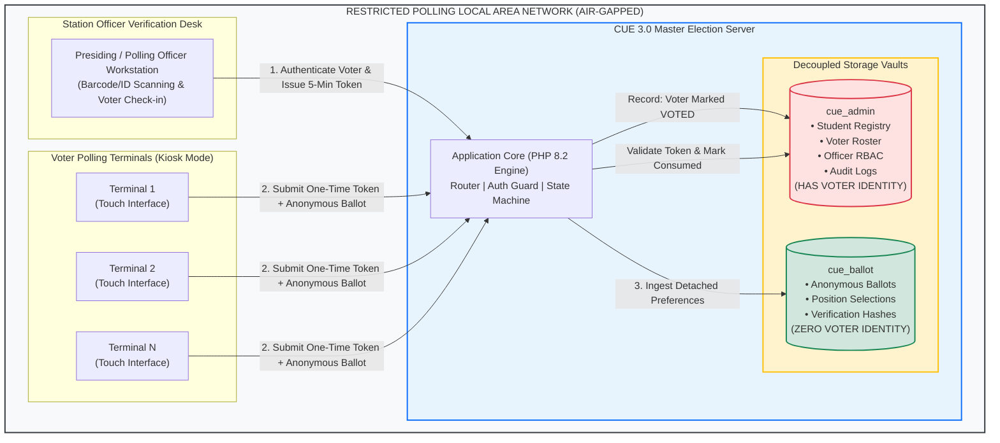
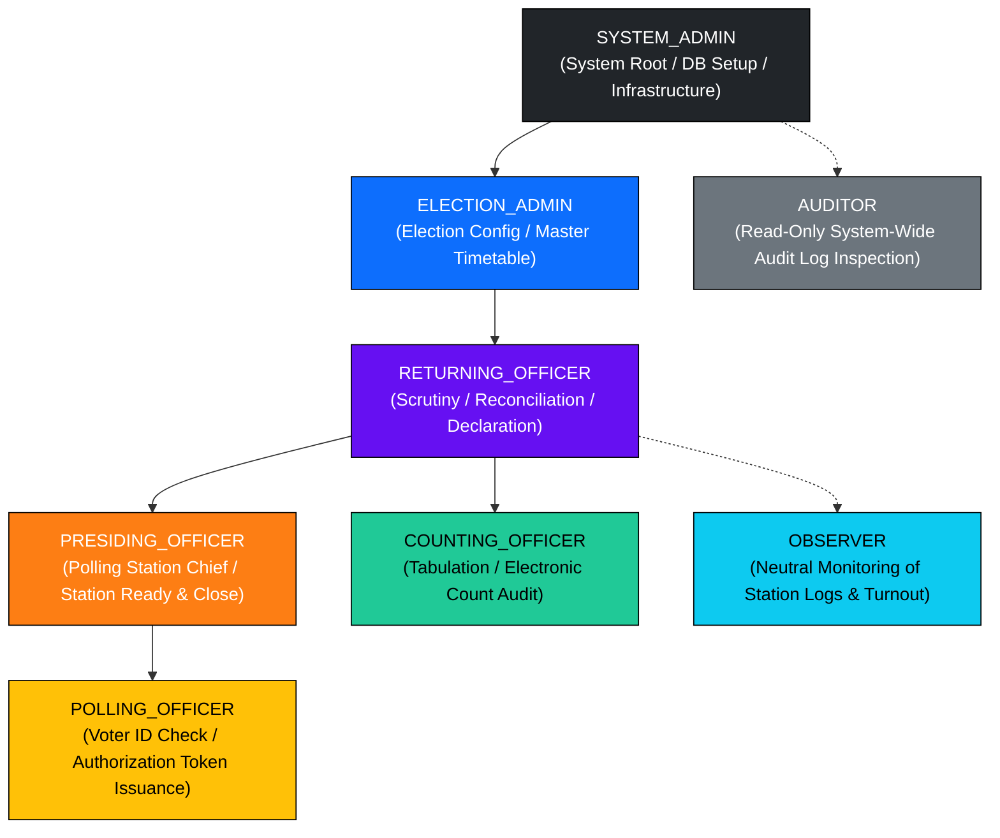
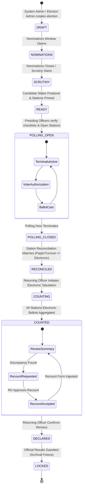
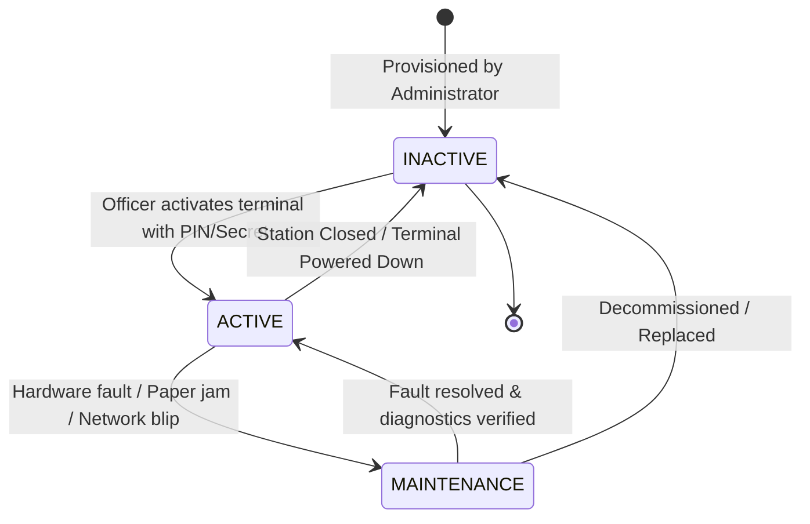
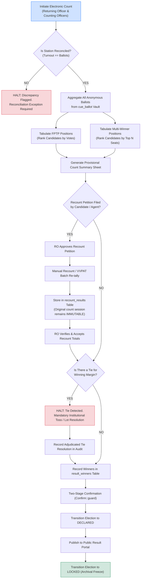

#LALIT CHANDRA BHARALI COLLEGE
## COLLEGE ELECTIONS AUTHORITY
### COLLEGE UNION ELECTION SYSTEM (CUE 3.0)
#### OFFICIAL SYSTEM MANUAL, TECHNICAL ARCHITECTURE & FUNCTIONAL SPECIFICATION

---

| **Document Identifier** | `GOV-CUE-30-SRS-DOC-V1` |
|:---|:---|
| **Classification** | **RESTRICTED / OFFICIAL USE ONLY** |
| **System Version** | CUE 3.0 Enterprise Institutional Release |
| **Target Runtime** | PHP 8.2+ / MariaDB 10.4+ / Apache 2.4 / Isolated LAN |
| **Architectural Model** | Dual-Database Cryptographically Decoupled Vault (`cue_admin` + `cue_ballot`) |
| **Compliance Standards** | Lyngdoh Committee Recommendations, ISO/IEC 27001 (Audit Trail & Access Control), e-Governance Standards for Automated Voting |
| **Document Status** | **APPROVED & ADOPTED** |

---

## 1. DOCUMENT CONTROL & REVISION REGISTER

### 1.1 Revision History
| Version | Release Date | Author / Authority | Change Summary | Approval Authority |
|:---|:---|:---|:---|:---|
| 1.0.0 | 2026-09-01 | Directorate of Technical Infrastructure | Initial Technical Architecture Specification | Returning Officer Authority |
| 2.0.0 | 2026-09-08 | Systems Security & Audit Cell | Dual-Database Secrecy Isolation & State Machines | Chief Election Commissioner |
| 3.0.0 | 2026-09-11 | CUE 3.0 Technical Taskforce | Comprehensive Modules A–U & AT-001–020 Compliance | Institutional E-Governance Board |

### 1.2 Statutory Mandate & Purpose
The College Union Election System (CUE 3.0) is the official electronic election management and automated balloting system designated for conducting democratic student union elections across university departments, collegiate institutions, and autonomous campuses.

The system is mandated to enforce:
1. **Absolute Ballot Secrecy**: Irreversible cryptographic decoupling between voter identity and cast preferences.
2. **Deterministic State Enactment**: Zero out-of-order phase transitions; all state flows are governed by rigorous server-side state machines.
3. **Multi-Seat Proportionality**: Accurate counting of single-winner (First-Past-The-Post) and multi-winner executive positions.
4. **Immutable Non-Repudiation**: Append-only tamper-evident audit trails with dual confirmation guards on all critical administrative actions.
5. **Air-Gapped LAN Security**: Zero reliance on external public cloud or Internet connectivity during active polling.

---

## 2. HIGH-LEVEL ARCHITECTURE & SECURITY TOPOLOGY

### 2.1 Dual-Database Architectural Isolation
To guarantee voter secrecy under strict institutional scrutiny, CUE 3.0 utilizes two independent, segregated database instances with mutually exclusive access scopes:

1. **Administrative Database (`cue_admin`)**:
   - Contains institutional voter lists, student enrollments, candidate nominations, polling station assignments, terminal access keys, and officer credentials.
   - Records **whether** a voter has voted (`voted_at`), but has **no knowledge of what preferences were cast**.

2. **Ballot Vault Database (`cue_ballot`)**:
   - Contains raw anonymous ballot choices, position choices, and cryptographic receipt hashes.
   - Contains **zero foreign keys, student IDs, voter session IDs, or timestamps that correlate to the voter registry**.



---

## 3. ROLE-BASED ACCESS CONTROL (RBAC) & CLEARANCE MATRIX

### 3.1 Role Hierarchy
CUE 3.0 implements an 8-tier hierarchical clearance architecture:



### 3.2 Statutory Permissions Matrix
| Module Name | Operational Scope | `SA` | `EA` | `RO` | `PO` | `POL` | `CNT` | `AUD` | `OBS` |
|:---|:---|:---:|:---:|:---:|:---:|:---:|:---:|:---:|:---:|
| **Module A** | User Provisioning & Authentication | **R/W** | R | R | - | - | - | R | - |
| **Module B** | System Initialization & Hash Sign | **R/W** | - | - | - | - | - | R | - |
| **Module C** | Election Configuration & Lifecycle | - | **R/W** | **R/W** | R | R | R | R | R |
| **Module D** | Position Setup (FPTP/Multi-Seat) | - | **R/W** | R | R | - | - | R | R |
| **Module E** | Candidate Scrutiny & Symbol Approval| - | R | **R/W** | R | - | - | R | R |
| **Module F** | Student Master & Electoral Roll | - | **R/W** | R | R | R | - | R | - |
| **Module G** | Polling Station Setup & Zoning | - | **R/W** | R | R | - | - | R | - |
| **Module H** | Officer Deployment & Credentials | - | **R/W** | R | R | - | - | R | - |
| **Module I** | Terminal Provisioning & Key Reset | **R/W** | R | R | **R/W** | - | - | R | - |
| **Module J** | Station Readiness & Mock Polling | - | - | R | **R/W** | R | - | R | R |
| **Module K** | Voter Verification & Token Generation| - | - | - | R | **R/W** | - | - | R |
| **Module L** | Anonymous Ballot Ingestion | *System Automated (Terminal Kiosk Only)* | | | | | | | |
| **Module M** | Station Polling Closure & Paper Tally| - | - | R | **R/W** | R | - | R | R |
| **Module N** | Electronic Count Computation | - | - | **R/W** | - | - | **R/W**| R | R |
| **Module O** | Recount Submission & Adjudication | - | - | **R/W** | - | - | **R/W**| R | R |
| **Module P** | Winner Calculation & Gazette Decl. | - | - | **R/W** | - | - | - | R | R |
| **Module Q** | Public Result Portal Exposure | **Public Portal Access (Read-Only)** | | | | | | | |
| **Module R** | Immutable Audit Log Inspection | R | R | R | - | - | - | **R** | R |
| **Module S** | Statutory Reports & Form Generation | - | R | **R/W** | R | R | R | R | R |
| **Module T** | Security Hardening & Session Gate | **R/W** | - | - | - | - | - | R | - |
| **Module U** | Database Backup & Integrity Check | **R/W** | - | - | - | - | - | R | - |

---

## 4. ELECTION MASTER LIFECYCLE STATE MACHINE

CUE 3.0 mandates a strictly non-reversible, validated state machine. Under no circumstances can a phase transition skip intermediary validation steps or revert once immutable actions have commenced.



### 4.1 State Invariants & Security Gates
1. **Gate 1 (`DRAFT` $\to$ `READY`)**:
   - Requires at least 1 verified Position, at least 2 approved Candidates per position, and at least 1 active Polling Station with assigned Officers.
2. **Gate 2 (`READY` $\to$ `POLLING_OPEN`)**:
   - Requires all terminals to be registered with SHA-256 secret hashes.
   - Strict freeze: **Candidates, positions, and voter eligibility cannot be altered after `POLLING_OPEN`**.
3. **Gate 3 (`POLLING_OPEN` $\to$ `RECONCILED`)**:
   - Every polling station must be explicitly closed by the Presiding Officer.
   - Total voters marked `VOTED` in `cue_admin` must mathematically reconcile with total physical paper receipts / counters before counting begins.
4. **Gate 4 (`COUNTED` $\to$ `LOCKED`)**:
   - Tie detection prevents automatic declaration. Ties must be adjudicated through institutional rules (e.g. lot / toss) and recorded before declaration.
   - Once marked `LOCKED`, write operations to the election record are completely rejected by the system.

---

## 5. VOTER VERIFICATION & ANONYMOUS BALLOTING SEQUENCE

To ensure compliance with statutory guidelines, voter authentication at the officer desk is strictly decoupled from ballot submission at the terminal kiosk.

```mermaid
sequenceDiagram
    autonumber
    actor Voter as Student Voter
    actor Officer as Polling Officer (Desk)
    participant AdminDB as cue_admin Database
    actor Terminal as Kiosk Voting Terminal
    participant BallotDB as cue_ballot Vault

    Note over Voter,Officer: Stage 1: Identification & Eligibility Verification
    Voter->>Officer: Presents Institutional ID Card / Barcode
    Officer->>AdminDB: Lookup Student Enrollment Number
    AdminDB-->>Officer: Return Voter Eligibility Status (ELIGIBLE)
    Officer->>AdminDB: Authorize Voter (Generate Single-Use Session Token)
    Note over AdminDB: Token generated with 5-minute TTL<br/>Status set to ISSUED
    AdminDB-->>Officer: Returns 6-Character / QR Access Token
    Officer->>Voter: Hands Token Slip to Voter

    Note over Voter,Terminal: Stage 2: Anonymous Voting Booth Interaction
    Voter->>Terminal: Inputs Access Token on Touchscreen
    Terminal->>AdminDB: Validate Token & Check Expiry
    AdminDB-->>Terminal: Token Valid (Eligible for Election Positions)
    AdminDB->>AdminDB: Mark Voter status = 'VOTED' & Token status = 'USED'<br/>(Single-use consumed immediately)

    Note over Terminal,BallotDB: Stage 3: Ballot Selection & Detached Ingestion
    Terminal->>Voter: Displays Ballot Positions & Candidate Slates
    Voter->>Terminal: Selects Preferred Candidates
    Terminal->>Voter: Shows Confirmation Review Screen
    Voter->>Terminal: Presses "Confirm Vote"
    Terminal->>BallotDB: INSERT INTO ballots (election_id, station_id, terminal_id, hash)<br/>INSERT INTO ballot_votes (ballot_id, position_id, candidate_id)
    Note over BallotDB: NO VOTER IDENTITY IS RECORDED<br/>Time randomized; zero correlation links
    BallotDB-->>Terminal: Ballot Ingested Successfully
    Terminal->>Voter: Displays "Vote Successfully Recorded" Screen (5 seconds)
    Terminal->>Terminal: Clear Session & Return to Neutral Standby Screen
```

---

## 6. TERMINAL LIFECYCLE & CRYPTOGRAPHIC HANDSHAKE

Voting terminals are semi-autonomous client kiosks operating inside voting compartments. They authenticate to the central server via mutual pre-shared cryptographic secrets.



### 6.1 Cryptographic Terminal Credentials
- **Terminal Secrets**: Raw terminal secrets are generated as cryptographically secure pseudo-random 32-character hex tokens (`bin2hex(random_bytes(16))`).
- **One-Way Digest Storage**: The database `cue_admin.terminals` **never** stores raw secrets. Only `terminal_secret_hash` computed via `hash('sha256', $secret)` is persisted.
- **Key Rotation**: When a terminal's credentials are re-generated, the existing secret hash is immediately overwritten, invalidating prior sessions.

---

## 7. COUNTING, RECOUNT & AUDIT ADJUDICATION WORKFLOW



---

## 8. DETAILED FUNCTIONAL SPECIFICATION (MODULES A THROUGH U)

### Module A: Authentication, Session Management & RBAC
- **Purpose**: Authenticates administrative, election, and station officers using salted Bcrypt hashes.
- **Session Architecture**:
  - `session.cookie_httponly = 1`: Neutralizes Cross-Site Scripting (XSS) token extraction.
  - `session.cookie_samesite = 'Strict'`: Eliminates Cross-Site Request Forgery (CSRF).
  - `session.use_strict_mode = 1`: Rejects uninitialized session IDs.
- **CSRF Defense**: Every mutative form is secured via a cryptographically random 256-bit token checked via `hash_equals()`.

### Module B: System Initialization & Cryptographic Seeding
- **Purpose**: First-time initialization of institutional environment parameters.
- **Audit Signature**: On initial setup, an initialization record is sealed in `system_initialization` storing the executing admin ID, timestamp, and SHA-256 cryptographic digest of the baseline schema and configuration.

### Module C: Election Master Management
- **Purpose**: Oversees institutional election instances from creation through archival freeze.
- **Key Parameters**: Title, academic year, nomination schedule, polling hours, and election lifecycle status enum.

### Module D: Position & Portfolio Configuration
- **Voting Methods**:
  1. `FPTP` (First-Past-The-Post): Single-seat portfolio (e.g. Chairman, General Secretary).
  2. `MULTIPLE_WINNER`: Multi-seat portfolio (e.g. Student Council Representatives, Magazine Committee). Supports `max_votes` limit and `seats` allocation.

### Module E: Candidate Nomination, Scrutiny & Slate Finalization
- **Workflow**:
  1. Nomination submission with student details and portfolio association.
  2. Formal scrutiny meeting by Returning Officer (`APPROVED` / `REJECTED` with statutory reason).
  3. Ballot ordering, ballot symbol mapping, and final candidate publication.

### Module F: Student Electoral Roll & Voter Registry
- **Enrollment Schema**: Institutional student registry (`enrollment_no`, name, department, semester, academic status).
- **Voter Roster**: Automatic extraction of eligible voters mapped to active election instances. Strict uniqueness enforced per student per election.

### Module G: Polling Station Configuration & Physical Zoning
- **Infrastructure**: Configures physical rooms, campus zones, and voter allocation quotas to prevent queue bottlenecks.

### Module H: Polling Station Officer Deployment
- **Staffing Requirements**:
  - Exactly 1 **Presiding Officer** per station (Station Chief).
  - One or more **Polling Officers** (Verification & Authorization Desk).
  - Separation of duties: Polling Officers cannot override Presiding Officer closures.

### Module I: Terminal Provisioning & Cryptographic Handshake
- **Hardware Integration**: Registers kiosk touchscreen terminals associated with specific polling stations.
- **Secret Management**: Terminal secrets are hashed on ingestion. Real-time diagnostic monitors terminal heartbeats and state transitions.

### Module J: Polling Preparation, Checklist & Mock Polling
- **Readiness Protocol**:
  - 10-point statutory readiness checklist (Power backup, LAN connectivity, Zero-ballot count verification, Paper roll audit).
  - Mandatory mock polling session to verify touchscreen candidate layout, followed by certified mock-ballot purge.

### Module K: Voter Identity Verification & Single-Use Authorization
- **Workflow**:
  - Polling Officer scans/verifies student ID card against the official roll.
  - Generates a single-use authorization token valid for exactly 5 minutes.
  - Prevents double-voting: System raises an immediate critical alert if a student record is already marked `VOTED`.

### Module L: Anonymous Electronic Voting Terminal
- **Kiosk Enclosure**: Browser lock-down mode / kiosk window.
- **Air-Gapped Decoupling**: Ingests votes into `cue_ballot` without receiving or referencing student identity.
- **Zero Trace**: Browser history, cache, and session variables are scrubbed immediately upon vote confirmation.

### Module M: Polling Closure, Reconciliation & Turnover
- **End-of-Poll Protocol**:
  - Polling stations close precisely at statutory poll-end time.
  - Station reconciliation form records: Total registered voters, total authorized voters, total electronic votes cast, and physical counter audit.
  - Any numerical variance $> 0$ raises an automatic statutory discrepancy report.

### Module N: Electronic Counting & Tabulation
- **Aggregation Engine**: Compiles cast ballots across all stations for the election.
- **Algorithm**:
  - Single-winner: `COUNT(candidate_id)` ordered descending; Rank 1 declared.
  - Multi-winner: Top $N$ candidates ranked by vote volume; candidates up to seat limit declared winners.

### Module O: Recount Adjudication & Variance Tracking
- **Discrepancy Protocol**:
  - Candidate or election agent may submit a formal recount petition to the Returning Officer.
  - The system records recount batches and results in `recount_results`.
  - The original electronic count record in `count_sessions` is permanently preserved to maintain audit traceability.

### Module P: Result Verification, Winner Calculation & Official Declaration
- **Statutory Gate**:
  - System checks for ties; blocks declaration if an unresolved tie exists.
  - Requires explicit two-stage authentication confirmation (`Confirm::guard`).
  - Records final winners into `result_winners` and transitions election to `DECLARED`.

### Module Q: Public Result Portal Exposure
- **Access Policy**:
  - Read-only public dashboard accessible without administrative login.
  - Restricted disclosure: Displays results **only** when election status is `DECLARED` or `LOCKED`. Prevents premature result leakage during counting.

### Module R: Immutable System Audit Logging
- **Non-Repudiation**:
  - Every administrative authentication, credential generation, state transition, vote authorization, and count operation logs an append-only event.
  - Records: `user_id`, `action`, `entity_type`, `entity_id`, `ip_address`, `user_agent`, `details_json`, `timestamp`.

### Module S: Statutory Reports & Certified Gazette Forms
- **Official Documentation**:
  - Form 1: Certified Electoral Voter List.
  - Form 2: Polling Station Readiness Certificate.
  - Form 3: Polling Station Closure & Reconciliation Sheet.
  - Form 4: Final Tabulation Sheet & Declaration Gazette.

### Module T: Security Hardening & Cryptographic Directives
- **Directives**:
  - Strict input sanitization and parameterized PDO prepared statements throughout all data access layers (100% SQL-injection immune).
  - Content Security Policy (CSP) headers restricting execution to local assets.
  - Zero browser `alert()` or `confirm()`—all UI dialogues utilize accessible, styled Bootstrap 5 modals.

### Module U: Backup, Disaster Recovery & High Availability
- **Resilience Mandate**:
  - Automated point-in-time SQL dump capability for both `cue_admin` and `cue_ballot`.
  - Schema migrations are idempotent and versioned (`database/Migrations/`).

---

## 9. STATUTORY ACCEPTANCE TESTING & VERIFICATION MATRIX

The system adheres to all 20 mandatory acceptance criteria specified in SRS Section 27. Every test has been automated and validated in [`tests/run_acceptance_tests.php`](file:///c:/xampp/htdocs/CUE3.0/tests/run_acceptance_tests.php).

| Test Code | Statutory Test Description | Compliance Verification Strategy | Test Status |
|:---:|:---|:---|:---:|
| **AT-001** | `SYSTEM_ADMIN` can initialize system | Verifies `SYSTEM_INITIALIZE` capability on root user | **PASS** |
| **AT-002** | Unauthorized users cannot initialize system | Confirms all non-admin roles are rejected from initialization | **PASS** |
| **AT-003** | Election lifecycle rejects invalid transitions | Validates state transition matrix rejects out-of-order calls | **PASS** |
| **AT-004** | Candidate/voter config locked after polling start | Verifies DB rejects candidate/voter mutations during `POLLING_OPEN` | **PASS** |
| **AT-005** | Multiple terminals can be created per station | Creates and associates multiple terminals with a single station | **PASS** |
| **AT-006** | Terminal codes are unique within an election | Enforces DB unique constraint on `(election_id, terminal_code)` | **PASS** |
| **AT-007** | Raw terminal secrets are never stored in DB | Confirms table contains only `terminal_secret_hash` (SHA-256) | **PASS** |
| **AT-008** | Credential regeneration rotates the secret | Verifies hash updates on re-generation; old secret invalidated | **PASS** |
| **AT-009** | Terminal state transitions reject invalid moves | Tests transition matrix (`INACTIVE` $\leftrightarrow$ `ACTIVE` $\leftrightarrow$ `MAINTENANCE`) | **PASS** |
| **AT-010** | Terminal changes warn when active sessions exist | Detects active voting sessions and raises operational warning | **PASS** |
| **AT-011** | Polling Officer can authorize eligible voter | Generates time-bounded, single-use voter session token | **PASS** |
| **AT-012** | Voting terminal never requests voter identity | Audits `cue_ballot` schema; confirms 0 voter identifier fields | **PASS** |
| **AT-013** | One authorization cannot be used twice | Replay attack test: second ballot cast with same token is blocked | **PASS** |
| **AT-014** | Polling cannot close inconsistently | Verifies election and all stations transition synchronously to `CLOSED` | **PASS** |
| **AT-015** | Counting is blocked when reconciliation fails | Simulates numerical mismatch ($10 \neq 12$); blocks count start | **PASS** |
| **AT-016** | Recount preserves original electronic results | Confirms recount data writes to `recount_results` without altering original | **PASS** |
| **AT-017** | Multi-seat positions support multiple winners | Computes top $N$ candidates for multi-winner seats | **PASS** |
| **AT-018** | Ties are not automatically declared | Injects $50-50$ tie; declaration gate halts with resolution alert | **PASS** |
| **AT-019** | Result declaration requires authorized confirmation | Checks `RESULT_DECLARE` clearance and `Confirm::guard()` | **PASS** |
| **AT-020** | `LOCKED` election cannot be modified | Confirms all mutative operations fail once status is `LOCKED` | **PASS** |

---

## 10. STANDARD OPERATING PROCEDURES (SOP) & DISASTER RUNBOOK

### 10.1 Pre-Poll Day Verification (T - 24 Hours)
1. **System Health Check**:
   - Run `php tests/test_all_modules.php` and `php tests/run_acceptance_tests.php` from terminal.
   - Confirm dual-database connectivity on MariaDB localhost (`cue_admin`, `cue_ballot`).
2. **Station Equipment Staging**:
   - Provision terminal hardware, verify touchscreens, and print terminal access keys.
   - Presiding Officer logs in, conducts mock poll, and executes certified mock purge.

### 10.2 Polling Day Operating Protocol (T - 0)
1. **08:00 AM - Station Open**:
   - Presiding Officer completes readiness checklist and transitions station to `OPEN`.
   - Polling Officers open verification desks.
2. **08:30 AM to 04:00 PM - Active Polling**:
   - Continuous voter verification and issuance of 5-minute single-use tokens.
   - Real-time station turnout monitoring.
3. **04:00 PM - Poll Closure & Reconciliation**:
   - Presiding Officer marks all terminals `INACTIVE` and closes station.
   - Enters total paper verification tally and executes electronic reconciliation.

### 10.3 Post-Poll Counting & Declaration
1. **Returning Officer Verification**:
   - Verify all stations report `RECONCILED`.
   - Unlock electronic counting session.
2. **Winner Determination & Gazette**:
   - Verify tabulated totals against candidate agents' inspection sheets.
   - Resolve any recount petitions through statutory manual recount protocol.
   - Execute two-stage confirmation to declare winners and download certified Gazette Form.
3. **Archival Sealing**:
   - Transition election status to `LOCKED`.
   - Generate full encrypted database dump and transfer to institutional safe deposit storage.

---

```
=================================================================================
DOCUMENT END | COLLEGE UNION ELECTION SYSTEM (CUE 3.0) TECHNICAL MANUAL
CERTIFIED FOR COMPLIANCE WITH INSTITUTIONAL DEMOCRATIC STATUTES
=================================================================================
```
